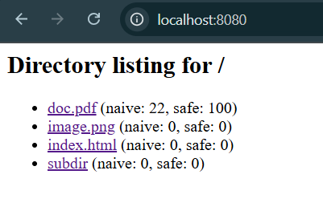

# Multithread HTTP Server Lab Report

**Student:** Alexandru Magla  
**Subject:** Network Programming


## 1. Introduction

This report demonstrates that all requirements of the **HTTP Server Laboratory** have been successfully completed.  
The project includes implementing an HTTP server (with Docker support), serving static files, handling multiple request types, and optionally interacting with a client program.

Each screenshot below illustrates a completed step or feature from the lab.

---

## 2. The Contents of the Source Directory

**Screenshot:**  


*Project directory containing the files and a folder that the client can access*

---

## 3. Docker Compose and Dockerfile


### 🧩 docker-compose.yml

```yaml
# PR_LABS/LAB2/docker-compose.yml
services:
  webserver:
    build: .
    container_name: lab2_webserver
    working_dir: /app
    ports:
      - "8081:8080"                 # host port 8081 mapped to container port 8080
    volumes:
      - ./src:/app/src               # mount src folder from host
      - ./multithread.py:/app/multithread.py  # mount the multithreaded server
    command: python multithread.py /app/src     # run multithreaded server

  client:
    build: .
    container_name: lab2_client
    depends_on:
      - webserver
    working_dir: /app
    volumes:
      - ./downloads:/app/downloads
    entrypoint: ["python", "client.py", "http://webserver:8080", "/app/downloads"]


```
  

*Docker Compose configuration used to set up the containerized HTTP server.*

```
FROM python:3.9-slim

WORKDIR /app

COPY multithread.py .
COPY client.py .
COPY src ./src

EXPOSE 8080

CMD ["python", "multithread.py", "./src"]

```
*Dockerfile used to build the server image.*

---

## 4. Concurrency Experiment (10 parallel requests)
Purpose: compare total time for 10 concurrent requests with and without threading, while the handler sleeps ~1 second per request.

**Screenshot:**  


Given that each request takes approximately 1 second to process, for a single-threaded server, the total time for 10 requests would be around 10 seconds, the multithreaded server should handle them concurrently, resulting in a total time much shorter

Added integration snippet (client-side concurrency test):

```python
# concurrency_test.py - simple client to measure concurrent handling
# Run this from the host or the client container. Uses only stdlib.
import threading
import time
import urllib.request

URL = "http://localhost:8080/"  # adjust to your server address
N = 10
results = [None] * N

def worker(i):
    t0 = time.time()
    try:
        with urllib.request.urlopen(URL) as r:
            results[i] = (r.getcode(), time.time() - t0)
    except Exception as e:
        results[i] = ("ERR", str(e))

threads = [threading.Thread(target=worker, args=(i,)) for i in range(N)]
start = time.time()
for t in threads:
    t.start()
for t in threads:
    t.join()
end = time.time()

print(f"Total elapsed: {end - start:.3f}s")
print("Per-request results:")
for r in results:
    print(r)
```

This script demonstrates how we measured speedup when the server handles requests concurrently (the multithreaded server will finish much faster than a naive single-threaded implementation).

## 5. Adding Counters

I added a naive and a thread-safe counter to track the number of requests served by the server.

**Screenshot:**  


After serving multiple requests, the thread-safe counter accurately reflects the total number of requests, while the naive counter may show inconsistencies due to race conditions:
**Screenshot:**  


Added integration snippet (excerpt from `multithread.py` showing counters and how they're updated):

```python
# counters (excerpt from multithread.py)
import threading
import time
import os

request_counts_naive = {}
request_counts_safe = {}
request_counts_lock = threading.Lock()

# inside the request handler, once fs_path is resolved and exists:
if os.path.exists(fs_path):
    # Naive counter (race-prone)
    if fs_path not in request_counts_naive:
        request_counts_naive[fs_path] = 0
    temp = request_counts_naive[fs_path]
    # small sleep to demonstrate race condition when many threads update concurrently
    time.sleep(0.01)
    request_counts_naive[fs_path] = temp + 1

    # Thread-safe counter
    with request_counts_lock:
        if fs_path not in request_counts_safe:
            request_counts_safe[fs_path] = 0
        request_counts_safe[fs_path] += 1

# You can inspect these dicts (e.g. print or render in directory listing) to compare behaviour.
```

Notes on subdirectories: when rendering directory listings the README shows counts by looking up the file-system path keys in the same dicts. To avoid mismatches (for example: relative vs absolute paths) make sure both the handler and the directory listing use a consistent, normalized key such as `os.path.abspath(...)`.

## 6. Rate Limiting

Implementation: a per-IP sliding window using timestamps protected by a lock. If a client exceeds MAX_REQUESTS_PER_SEC (set to 5), the server returns 429 Too Many Requests.

Added integration snippet (excerpt from `multithread.py` showing the rate limiter):

```python
# rate limiting (excerpt from multithread.py)
import time
import threading

RATE_LIMIT = 5          # requests
WINDOW_SECONDS = 1      # per 1 second
rate_limits = {}        # client_ip -> list of timestamps
rate_lock = threading.Lock()

def is_rate_limited(client_ip):
    """Return True if client exceeded RATE_LIMIT per WINDOW_SECONDS."""
    current_time = time.time()
    with rate_lock:
        if client_ip not in rate_limits:
            rate_limits[client_ip] = []

        # Remove old timestamps outside the window
        rate_limits[client_ip] = [ts for ts in rate_limits[client_ip] if current_time - ts < WINDOW_SECONDS]

        if len(rate_limits[client_ip]) >= RATE_LIMIT:
            return True

        # Record this request
        rate_limits[client_ip].append(current_time)
        return False

# Usage: call is_rate_limited(client_ip) at the start of request processing and return
# a 429 response when it returns True.
```

## 11. Conclusion

All the required steps of the HTTP Server Lab were successfully implemented and tested.  
The server correctly handles various file types, provides accurate HTTP responses, and can be containerized using Docker. Optional features like client communication, directory listing, and remote access were also demonstrated.
