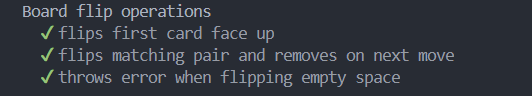
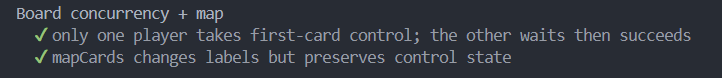
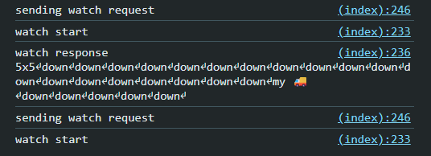
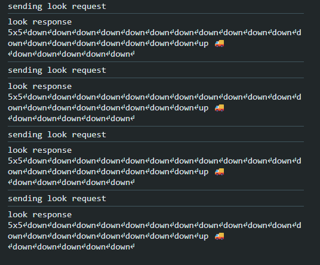

# Lab 3: Memory Scramble - Concurrent Game Server

## Overview

This project implements a multiplayer Memory game where players flip cards simultaneously. The main challenge was building a thread-safe server that handles concurrent operations without race conditions.

**What I Learned:** Promise-based synchronization, mutex implementation, observer pattern for real-time updates, and testing concurrent behavior.

---

## Problem 1: Board Parsing and Representation

**Goal:** Parse game files and maintain board state.

**Board Format:**

```
3x3
🦄
🦄
🌈
🌈
🌈
🦄
🌈
🦄
🌈
```

**Core Data Structure:**

```typescript
type Spot = {
  card: string | null;
  faceUp: boolean;
  controller: string | null;
};
```

**Key Design Decision - Private Constructor:**

- Factory pattern (`parseFromFile`) ensures all boards are valid
- Single point of validation prevents invalid states
- `checkRep()` validates invariants after construction


---

## Problem 2: Look and Flip Operations

**Goal:** Implement game commands following Memory Scramble rules.

**Game Rules Implemented:**

**First Card (Rule 1):**

- No card → throw error
- Controlled by another → wait (Problem 3)
- Face-down → flip up and take control
- Face-up → take control

**Second Card (Rule 2):**

- No card → throw error, release first
- Controlled → throw error, release first
- Match → keep both
- No match → release both (stay face-up)

**Cleanup (Rule 3):**

- Matched cards → remove from board
- Non-matching → flip face-down (if not controlled)

**Commands Implementation:**

```typescript
export async function look(board: Board, playerId: string): Promise<string> {
  return board.renderFor(playerId);
}

export async function flip(
  board: Board,
  playerId: string,
  row: number,
  column: number
): Promise<string> {
  await board.flip(row, column, playerId);
  return board.renderFor(playerId);
}
```



---

## Problem 3: Concurrency Safety with AsyncMutex

**The Problem:** Without synchronization, race conditions occur:

```
Time    Alice's Thread              Bob's Thread
----    --------------              ------------
t0      check: controller == null   check: controller == null
t1      controller = "alice"
t2                                  controller = "bob" ← CORRUPTED!
```

**Solution: AsyncMutex**

I implemented a mutex that queues waiting operations using promises:

```typescript
class AsyncMutex {
  private locked = false;
  private readonly queue: Array<() => void> = [];

  async runExclusive<T>(fn: () => T | Promise<T>): Promise<T> {
    await this.acquire();
    try {
      return await fn();
    } finally {
      this.release(); // Always releases, even on error
    }
  }

  private acquire(): Promise<void> {
    if (!this.locked) {
      this.locked = true;
      return Promise.resolve();
    }
    const { promise, resolve } = Promise.withResolvers<void>();
    this.queue.push(resolve);
    return promise;
  }

  private release(): void {
    const next = this.queue.shift();
    if (next) {
      next(); // Wake next waiter
    } else {
      this.locked = false;
    }
  }
}
```

**Why This Works:**

- ✅ Zero CPU usage while waiting (no busy-wait loops)
- ✅ FIFO ordering (fair)
- ✅ Automatic cleanup (try-finally)
- ✅ No race conditions (operations are serialized)

**Waiting for Cards (Rule 1-D):**

When a player tries to flip a card controlled by another player:

```typescript
for (;;) {
  let done = false;
  await this.mutex.runExclusive(async () => {
    if (spot.controller !== null && spot.controller !== player) {
      waiter = this.spotSignals[row][col].promise;
      return; // Exit, will wait outside lock
    }
    this.flipFirstCard(row, col, player, spot, state);
    done = true;
  });

  if (done) break;
  if (waiter) await waiter; // Wait OUTSIDE lock
}
```

**Pattern:** Check atomically → Release lock → Wait → Retry



---

## Problem 4: Map Operation with Interleaving

**Goal:** Transform all cards while allowing concurrent flips.

**Constraints:**

- **Pairwise consistency:** Matching cards stay matching
- **Allow interleaving:** Flips can happen during transformation
- **No blocking:** Don't freeze the board

**Three-Phase Strategy:**

```typescript
public async mapCards(f: (card: string) => Promise<string>): Promise<void> {
    // Phase 1: Collect labels (with lock)
    const labelToPositions = new Map<string, Array<{r: number, c: number}>>();
    await this.mutex.runExclusive(() => {
        // Snapshot all card positions
    });

    // Phase 2: Transform in parallel (NO lock!)
    const tasks = [];
    for (const [label, positions] of labelToPositions) {
        tasks.push((async () => {
            const newLabel = await f(label); // Slow operation

            // Phase 3: Apply atomically (with lock)
            await this.mutex.runExclusive(() => {
                for (const {r, c} of positions) {
                    if (this.grid[r][c].card === label) {
                        this.grid[r][c].card = newLabel;
                    }
                }
            });
        })());
    }
    await Promise.all(tasks);
}
```

**Why It Works:** Transform each unique label once, apply to all occurrences atomically. Matching cards get the same transformation.

---

## Problem 5: Watch Operation

**Goal:** Notify clients of changes without polling.

**The Problem:** Polling wastes bandwidth and adds latency.

**Solution - Observer Pattern:**

```typescript
private changeSignal = this.makeDeferred();

public async waitForChange(): Promise<void> {
    await this.changeSignal.promise;
}

private notifyChange(): void {
    this.changeSignal.resolve(); // Wake all watchers
    this.changeSignal = this.makeDeferred(); // New signal
}
```

**Visible changes:**

- Cards flip face-up/down
- Cards removed (matched)
- Card labels change (map)

**Command:**

```typescript
export async function watch(board: Board, playerId: string): Promise<string> {
  await board.waitForChange();
  return board.renderFor(playerId);
}
```


_Watching client → keeps an open connection (stream) and updates automatically when the board changes_

_Polling client → repeatedly requests the board state every few seconds_

---

## Multi-Player Simulation

The simulation demonstrates concurrent gameplay with 4 players making 100 moves each:

```typescript
const players = 4;
const tries = 100;
const minDelayMilliseconds = 0.1;
const maxDelayMilliseconds = 2;

async function player(playerNumber: number): Promise<void> {
  const playerId = `sim-${playerNumber}`;
  for (let jj = 0; jj < tries; ++jj) {
    await timeout(randomDelay());

    // Try first card
    const r1 = randomInt(size);
    const c1 = randomInt(size);
    try {
      await board.flip(r1, c1, playerId);
      console.log(`Player ${playerId} flipped first: (${r1},${c1})`);
    } catch (err) {
      continue; // First flip failed
    }

    await timeout(randomDelay());

    // Try second card
    const r2 = randomInt(size);
    const c2 = randomInt(size);
    try {
      await board.flip(r2, c2, playerId);
      console.log(`Player ${playerId} flipped second: (${r2},${c2})`);
    } catch (err) {
      // Second flip failed
    }
  }
}
```

**Simulation Results:**

```
=== Simulation complete ===
players: 4, moves each: 100, total moves (attempts): 400
stats: {
  attemptedFirst: 400,
  successFirst: 83,
  attemptedSecond: 83,
  successSecond: 17,
  errors: 383
}
```

**Analysis:**

- **83/400 first flips succeeded** (21%) - many failed due to:
  - Cards already removed by other players
  - Cards controlled by other players (waiting timeout)
- **17/83 second flips succeeded** (20%) - failures from:
  - Random second card also removed/controlled
  - Trying to flip own first card
- **High error rate is expected** - random positions often conflict in concurrent play

---

## Running the Project

### Start Server

```bash
npm install
npm start 8080 boards/perfect.txt
```

Output:

```
server now listening at http://localhost:8080
```

### Run Simulation

```bash
npm run simulation
```

### Run Tests

```bash
npm test
```


---

## Key Design Decisions

### 1. AsyncMutex Over Busy-Waiting

**Why:** Zero CPU usage, FIFO ordering, automatic cleanup

### 2. Per-Spot Signals

**Why:** Only wake players waiting for specific cards, not everyone

### 3. Three-Phase Map

**Why:** Maximum concurrency while maintaining consistency

### 4. Global Change Signal

**Why:** Simple, efficient (resolving promises is cheap)

---

## Bugs Encountered

### Bug 1: The Cleanup Timing Issue

**Problem:** Cleanup would flip cards face-down even when other players controlled them.

**Fix:** Check controller before flipping:

```typescript
if (spot.controller === null) {
  spot.faceUp = false;
}
```

### Bug 2: Self-Control Error

**Problem:** Player trying to flip their own first card as second card.

**Fix:** Special case detection:

```typescript
if (spot.controller === player) {
  throw new Error("you already control that card");
}
```

---

## What I Learned

**Technical Skills:**

- Promise-based synchronization patterns
- Mutex implementation from scratch
- Observer pattern for event-driven architecture
- Testing concurrent behavior

**Key Insights:**

- **Lock granularity matters** - Hold briefly, release before slow operations
- **Testing concurrent code is hard** - Need creative strategies
- **Performance vs. correctness** - Can optimize within correctness constraints

---

## Conclusion

This project successfully implements a concurrent multiplayer Memory Scramble game with:

- ✅ Thread-safe operations using AsyncMutex
- ✅ Promise-based waiting (no busy-waiting)
- ✅ Real-time updates via watch operation
- ✅ Efficient card transformations with interleaving

The implementation demonstrates proper concurrent programming in TypeScript, with careful attention to atomicity, consistency, and performance.
