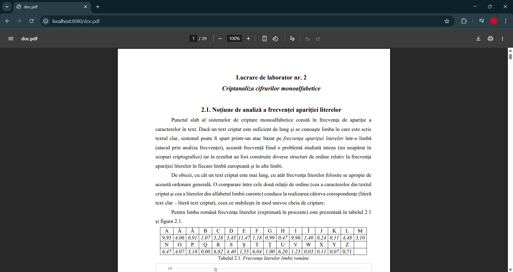

# HTTP Server Lab Report

**Student:** Alexandru Magla  
**Subject:** Network Programming


## 1. Introduction

This report demonstrates that all requirements of the **HTTP Server Laboratory** have been successfully completed.  
The project includes implementing an HTTP server (with Docker support), serving static files, handling multiple request types, and optionally interacting with a client program.

Each screenshot below illustrates a completed step or feature from the lab.

---

## 2. The Contents of the Source Directory

**Screenshot:**  


*Project directory containing the files and a folder that the client can access*

---

## 3. Docker Compose and Dockerfile


### 🧩 docker-compose.yml
```yaml
version: "3.9"

services:
  webserver:
    build: .
    container_name: pr_labs_webserver
    ports:
      - "8080:8080"
    volumes:
      - ./src:/app/src

  client:
    build: .
    container_name: pr_labs_client
    depends_on:
      - webserver
    volumes:
      - ./downloads:/app/downloads
    entrypoint: ["python", "client.py"]
    
 ```
  

*Docker Compose configuration used to set up the containerized HTTP server.*

```
FROM python:3.9-slim

WORKDIR /app

COPY server.py .
COPY client.py .
COPY src ./src

EXPOSE 8080

# Default command is server
CMD ["python", "server.py", "./src"] 
```
*Dockerfile used to build the server image.*

---

## 4. Starting the Container

**Screenshot:**  

*Container started successfully and server initialized.*

---

## 5. Running the Server Inside the Container

**Screenshot:**  

*HTTP server launched inside the container with the specified directory.*

---

## 6. Contents of the Served Directory


**Screenshot:**  

*Directory containing files served by the HTTP server.*

---

## 7. HTTP Requests from the Browser

### a) Inexistent File (404)
**Screenshot:**  

*Request to a non-existent file correctly returns a 404 error.*

### b) HTML File with Image
**Screenshot:**  
 
*Server correctly serves an HTML page displaying an image.*

### c) PDF File
**Screenshot:**  

*Browser successfully receives and displays a served PDF file.*

### d) PNG File
**Screenshot:**  

*Server successfully delivers a PNG image file to the browser.*

---

## 8. Client Execution (if implemented)

### How the Client is Run
**Screenshot:**  

*Command used to execute the client application.*

### Saved Files
**Screenshot:**  

*Files saved locally by the client after server response.*

---

## 9. Directory Listing (if implemented)

### Directory Listing Page
**Screenshot:**  

*Auto-generated directory listing page served by the server.*

### Subdirectory View
**Screenshot:**  

*Subdirectory structure displayed correctly in the browser.*

---

## 10. Browsing a Friend’s Server (if applicable)

### Network Setup
  
*My collegue and I connected on the same hotspot. Then through the terminal we found the IP adress, using `ipconfig` or `ifconfig`, then I was able to access her server and send requests through my client*

### Finding Friend’s IP
**Screenshot:**  

*Friend’s server IP address identified on the same network.*

### Friend’s Server Contents
**Screenshot:**  

*Directory contents displayed from the friend’s server.*

### Requests to Friend’s Server
**Screenshot:**  

*Successful file requests made to the friend’s server using browser or client.*

---


## 11. Conclusion

All the required steps of the HTTP Server Lab were successfully implemented and tested.  
The server correctly handles various file types, provides accurate HTTP responses, and can be containerized using Docker. Optional features like client communication, directory listing, and remote access were also demonstrated.
